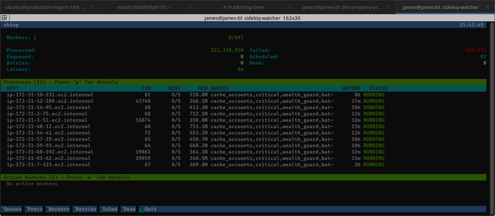

# sktop

A CLI tool to monitor Sidekiq queues and processes - like htop for Sidekiq.



## Installation

Add to your Gemfile:

```ruby
gem 'sktop'
```

Or install directly:

```bash
gem install sktop
```

## Usage

```bash
# Basic usage (auto-refresh every 2 seconds)
sktop

# Connect to a specific Redis instance
sktop -r redis://myhost:6379/1

# Custom refresh interval
sktop -i 5

# Start with a specific view
sktop -w          # Workers view
sktop -R          # Retries view
sktop -d          # Dead jobs view

# Display once and exit (no auto-refresh)
sktop -1
sktop -R -1       # Show retries view once and exit
```

## Options

| Option | Description |
|--------|-------------|
| `-r, --redis URL` | Redis URL (default: redis://localhost:6379/0 or REDIS_URL env var) |
| `-n, --namespace NS` | Redis namespace (e.g., 'myapp') |
| `-i, --interval SECONDS` | Auto-refresh interval in seconds (default: 2) |
| `-1, --once` | Display once and exit (no auto-refresh) |
| `-v, --version` | Show version |
| `-h, --help` | Show help |

### View Options (set initial view)

| Option | Description |
|--------|-------------|
| `-m, --main` | Main view - processes + workers (default) |
| `-q, --queues` | Queues view |
| `-p, --processes` | Processes view |
| `-w, --workers` | Workers view |
| `-R, --retries` | Retries view |
| `-s, --scheduled` | Scheduled jobs view |
| `-d, --dead` | Dead jobs view |

## Keyboard Navigation

| Key | Action |
|-----|--------|
| `m` | Main view (processes + workers) |
| `q` | Queues view |
| `p` | Processes view |
| `w` | Workers view |
| `r` | Retry queue view |
| `s` | Scheduled jobs view |
| `d` | Dead jobs view |
| `↑/↓` | Scroll / select items |
| `PgUp/PgDn` | Scroll by page |
| `Esc` | Return to main view |
| `Ctrl+C` | Quit |

### Process Actions (in Processes view)

| Key | Action |
|-----|--------|
| `Ctrl+Q` | Quiet selected process |
| `Ctrl+K` | Stop/kill selected process |

### Job Actions (in Retry/Dead views)

| Key | Action |
|-----|--------|
| `Ctrl+R` | Retry selected job |
| `Ctrl+X` | Delete selected job |
| `Alt+R` | Retry all jobs |
| `Alt+X` | Delete all jobs |

## Environment Variables

- `REDIS_URL` - Default Redis connection URL
- `SIDEKIQ_NAMESPACE` - Default Redis namespace
- `DEBUG` - Show stack traces on errors

## License

MIT License
